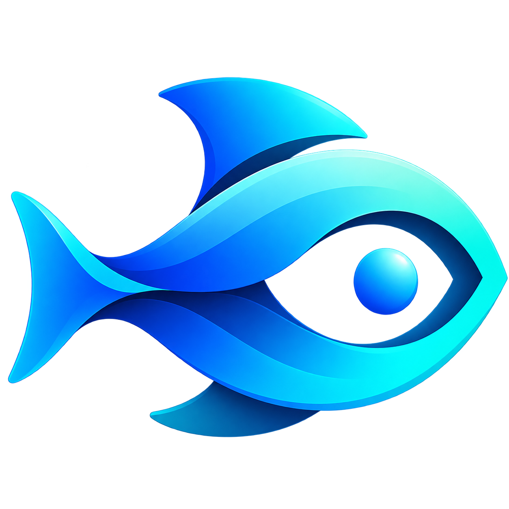

<div align="center">
<h1 align="center"> Locus </h1> 
<h3>Locus is a native macOS app designed to help you lock your focus. Create focused work sessions, reduce distractions, and keep your attention on what matters. Simple, lightweight, and built for deep work — right where you work.
</br></h3>
   
</br>
</br>
 
</div>

## Why Locus
Deep work on a laptop is hard when email, Slack, social networks, browsers and YouTube are one click away. Lose awareness for five minutes and you're doing shallow work or scrolling.

Locus locks the app you're working in. One click puts its window in full screen and starts a timer. Until the timer runs out, leaving that app means holding an Exit button for 25 seconds. That's long enough to notice what you're doing and change your mind.

## Features
- **Lives in the menu bar.** No Dock icon and no window to manage. The Locus fish sits in the menu bar in its original colors; during a session it gets a red alert badge and a countdown.
- **One-click lock.** Click the icon and the app you're in goes full screen for a focus session: 25 minutes by default, or whatever you choose.
- **Exit protection.** ⌘Q, ⌘H, ⌘M, ⌘Tab, the full-screen shortcut and switching Spaces bring you back and ask "Are you sure you want to exit?"
- **Hold to exit.** Ending early means holding **Exit** for 25 seconds. Let go or drag off and it starts over. **Go Back** (or Return/Esc) returns you to work.
- **Ends on its own.** When the timer runs out, the lock is released, Locus beeps twice and you get a notification.

## Install
Locus needs macOS 13 or later. There are three ways to install it:

| Method | Best for | Needs |
|---|---|---|
| [1. Download the DMG from GitHub](#1-download-the-dmg-from-github) | Most people | Nothing extra |
| [2. Build the app from source](#2-build-the-app-from-source) | Trying the latest code, development | Swift toolchain |
| [3. Build a DMG from source](#3-build-a-dmg-from-source) | Installing your own build in Applications, or copying it to another Mac | Swift toolchain |

### 1. Download the DMG from GitHub
1. Open the [Releases page](https://github.com/dimastatz/locus/releases) and download `Locus-<version>.dmg` from the latest release.
2. Open the DMG and drag **Locus** onto **Applications**. Then eject the disk image.
3. Open Locus from Applications. Because the app isn't notarized by Apple yet, macOS blocks the first launch:
   - **macOS 15 (Sequoia) and later:** click **Done** in the warning, then go to **System Settings → Privacy & Security**, scroll down and click **Open Anyway** next to the Locus message. Confirm with your password.
   - **macOS 13–14:** right-click **Locus** in Applications, choose **Open**, then click **Open** in the dialog.

   You only need to do this once per version. If you prefer the Terminal: `xattr -dr com.apple.quarantine /Applications/Locus.app`.

Each release also has a zipped `Locus.app` (`Locus-v<version>.zip`) if you'd rather not use the DMG; unzip it and move `Locus.app` to Applications.

### 2. Build the app from source
You need the Swift toolchain: Xcode, or just the Command Line Tools (`xcode-select --install`).

```sh
git clone https://github.com/dimastatz/locus.git
cd locus
./scripts/build-app.sh   # builds build/Locus.app
open build/Locus.app
```

This runs Locus straight from the `build` folder. To keep it, move it to Applications: `mv build/Locus.app /Applications/`. To update later, run `git pull` and the script again.

### 3. Build a DMG from source
Same requirements as method 2. The script builds the app and packages it into a drag-to-install disk image, like the one on the Releases page.

```sh
git clone https://github.com/dimastatz/locus.git
cd locus
./scripts/build-dmg.sh   # builds build/Locus-<version>.dmg
open build/Locus-*.dmg
```

Drag **Locus** onto **Applications**, eject the disk image, and open Locus from Applications. A DMG you built yourself isn't blocked by Gatekeeper on your own Mac. If you copy it to another Mac, follow step 3 of method 1 there.

Options: `./scripts/build-dmg.sh v0.3.0` sets the version in the file name (it defaults to the version in `Support/Info.plist`), and `SKIP_APP_BUILD=1` packages an existing `build/Locus.app` without rebuilding it.

### After installing
- **Allow Accessibility access.** On first launch, turn on Locus in **System Settings → Privacy & Security → Accessibility**. Locus needs it to put windows in full screen and keep them there.
- **Find it in the menu bar.** Locus has no Dock icon and no window; look for the fish at the top of the screen.
- **After updating or rebuilding,** macOS may ask for Accessibility access again, because the app is ad-hoc signed and each build has a new signature. If Locus is listed but doesn't work, select it in the Accessibility list, remove it with **−**, and add it again. Builders can avoid this by signing with their own identity: `CODESIGN_IDENTITY="Apple Development: …" ./scripts/build-app.sh` (also works with `build-dmg.sh`).

### Uninstall
Quit Locus from its menu (right-click the fish → **Quit Locus**), delete `Locus.app` from Applications, and remove it from **System Settings → Privacy & Security → Accessibility**.

## Usage
1. Click into the app you want to focus on.
2. Click the Locus fish in the menu bar and confirm with **Start**. The window goes full screen and the countdown (25 minutes by default) starts in the menu bar.
3. Trying to leave brings you back and asks "Are you sure you want to exit?" **Go Back** returns you to work; holding **Exit** for 25 seconds ends the session.
4. When the timer ends, the lock is released, Locus beeps twice and you get a notification.

| Action | How |
|---|---|
| Start a session | Left-click the menu bar icon, then **Start** (or Return) |
| Open the menu | Right-click or ⌃-click the icon (any click during a session) |
| Change the session length | Menu → **Focus Duration** → 15 / 25 / 45 / 60 / 90 min or **Custom…** (5–240 min) |
| End a session early | Menu → **End Session Early…**, then hold **Exit** for 25 seconds |

Locus is a commitment device, not parental control. Force-quitting it will release the lock.

## Development
```sh
swift build              # debug build
./scripts/test.sh        # unit tests (Swift Testing)
./scripts/coverage.sh    # tests + 95% line-coverage gate
./scripts/format.sh      # format with swift-format
./scripts/lint.sh        # swift-format lint + SwiftLint (brew install swiftlint)
./scripts/build-app.sh   # app bundle in build/
./scripts/build-dmg.sh   # drag-to-install disk image: build/Locus-<version>.dmg
```

CI runs lint, tests with the coverage gate, and the app build on every pull request. Pushing a `v*` tag publishes a GitHub release with the DMG and the zipped app.

| Path | Contents |
|---|---|
| `Sources/LocusCore/` | Session, timer, hold-to-exit and shortcut logic. No AppKit, unit tested. |
| `Sources/Locus/` | The menu bar app: status item, Accessibility window control, exit guard, prompts |
| `Tests/LocusCoreTests/` | Unit tests |
| `docs/specs/` | Product requirements ([PRD-0001](docs/specs/prd-0001-menu-bar-app.md) to [PRD-0004](docs/specs/prd-0004-session-completion.md)) |

## Roadmap
- Launch at login
- Breaks and repeating sessions (Pomodoro)
- Session history

## License
[MIT](LICENSE)
